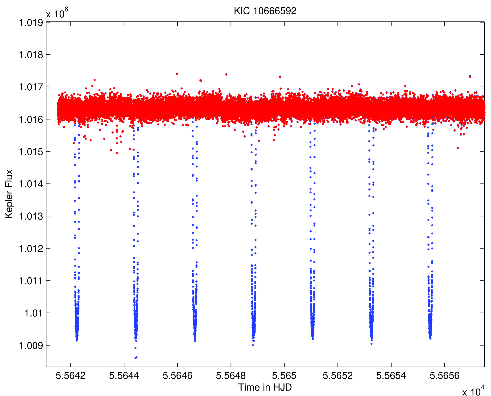

MIARMA
======

Source files for MIARMA, the gap-filling algorithm based on ARMA models.

MIARMA uses a forward-backward predictor based on autoregressive moving-average modeling (ARMA) in the time domain. The algorithm is particularly suitable for replacing invalid data such as those present in the light curves of space satellites (e.g. CoRoT, Kepler, TESS, PLATO, etc.) caused by instrumental effects, transit removal, or the impact of charged particles.

Files in folder \Plus are external tools developed by the same author for other purposes which are also necessary to run MIARMA.

Citing MIARMA
-------------
If you use MIARMA or any of the subroutines included, please cite the following references [Pascual-Granado, Garrido and Suárez 2015, A&A, 575. A78](https://ui.adsabs.harvard.edu/abs/2015A%26A...575A..78P/abstract) and [Pascual-Granado et al. 2018, A&A, 614, A40](https://ui.adsabs.harvard.edu/abs/2018A%26A...614A..40P/abstract). Here are the BibTeX sources:

```
@ARTICLE{2015A&A...575A..78P,
       author = {{Pascual-Granado}, J. and {Garrido}, R. and {Su{\'a}rez}, J.~C.},
        title = "{MIARMA: A minimal-loss information method for filling gaps in time series. Application to CoRoT light curves}",
      journal = {\aap},
     keywords = {asteroseismology, methods: data analysis, stars: oscillations, Astrophysics - Solar and Stellar Astrophysics},
         year = 2015,
        month = mar,
       volume = {575},
          eid = {A78},
        pages = {A78},
          doi = {10.1051/0004-6361/201425056},
archivePrefix = {arXiv},
       eprint = {1410.0841},
 primaryClass = {astro-ph.SR},
       adsurl = {https://ui.adsabs.harvard.edu/abs/2015A&A...575A..78P},
      adsnote = {Provided by the SAO/NASA Astrophysics Data System}
}

@ARTICLE{2018A&A...614A..40P,
       author = {{Pascual-Granado}, J. and {Su{\'a}rez}, J.~C. and {Garrido}, R. and {Moya}, A. and {Garc{\'\i}a Hern{\'a}ndez}, A. and {Rod{\'o}n}, J.~R. and {Lares-Martiz}, M.},
        title = "{Impact of gaps in the asteroseismic characterization of pulsating stars. I. The efficiency of pre-whitening}",
      journal = {\aap},
     keywords = {asteroseismology, methods: data analysis, stars: oscillations, stars: variables: {\ensuremath{\delta}} Scuti, Astrophysics - Solar and Stellar Astrophysics},
         year = 2018,
        month = jun,
       volume = {614},
          eid = {A40},
        pages = {A40},
          doi = {10.1051/0004-6361/201732431},
archivePrefix = {arXiv},
       eprint = {1801.02727},
 primaryClass = {astro-ph.SR},
       adsurl = {https://ui.adsabs.harvard.edu/abs/2018A&A...614A..40P},
      adsnote = {Provided by the SAO/NASA Astrophysics Data System}
 }
```

Getting Started
-----------
* Clone the project `$ git clone https://github.com/javier-iaa/MIARMA`
* Add to MATLAB path the folder of the repository and subfolder /Plus
* MIARMA is called from MATLAB using:
```matlab
strout = MIARMA( strdata )
``` 
Here input structure ``strdata`` must contain at least three fields: ``time``, ``data`` and ``stat``.

Output structure ``strout`` contains the fields: ``timeout``, ``datout`` and ``statout`` corresponding to corrected data.

Using MIARMA for removing transits in light curves
--------------------------------------------------
`miarma_tr` is a wrapper of MIARMA to run it on a file directly and remove transits before the gap-filling algorithm is applied. The removal procedure require transit parameters. When this is done a status array is generated to be used in the gap-filling process.
 
To call `miarma_tr` apart from the filename string `fname` a structure `transit_str` must be provided with the following fields:
-   `transit_str.porb`     is the orbital period in days
-   `transit_str.epoch`    is the mid-transit epoch in RJD
-   `transit_str.duration` is the transit duration in days

Other inputs that might be provided preceded by the corresponding tag name string are:
-  `nhead` is the number of header lines in the ASCII file (default 1)
-  `delim` is the string delimiter to use (default is ' ')
-  `timecol` is the column number for time (default is 1)
-  `magcol` is the column number for magnitude (default is 2)
-  `statcol` is the column number for the status of datapoints, i.e. the flag to decide when to interpolate or not. Status is modified after transit removal

Example for Kepler data (**section under construction**)

Folder /Tests contains the input files for these examples. The output files are also provided with the suffix _miarma_check in the name e.g. **`kplr010666592-2011116030358_slc_miarma_check.dat`** to verify that the script miarma_tr provides the expected output on these inputs.

Here is the code necessary to run the script with KIC10666592.

```matlab
fname = 'kplr010666592-2011116030358_slc.dat';
transit_str.porb = 2.204735427; 
transit_str.epoch = 54954.3585049999;
transit_str.duration = 0.164303;
 
miarma_tr(fname, transit_str, 'nhead', 8, 'delim', ' ', 'timecol', 1, 'magcol', 4);
```
This will generate an output file with 2 columns: time and flux. See below a plot illustrating the interpolation of the gaps after transit removal.



Getting In Touch, and Getting Involved
--------------------------------------

We welcome contributions and feedback. The best way to get in touch is via the issues page.
We're especially interested in hearing from you:

- If something breaks;
- If you have suggestions for future development;
- If you have your own code implementing any of the subroutines provided in MIARMA and it produces different answers.

If you have code you'd be willing to contribute, please send a pull request or open an issue.

Copyright & Licensing
---------------------
The code is distributed under the GNU GPL v3.0 license; see LICENSE for details.
All content © 2022 The Authors.

Note on version number
----------------------
Each version has (since 1.5.11.0) four numbers x.x.x.x, e.g. 1.0.0.0
- The fourth number refers to just minor corrections in MIARMA.m or individual subroutines not involving changes in other ones, e.g. 1.0.0.1 
- The third number refers to corrections involving several subroutines, e.g. 1.0.1.0
- The second number refers to major changes in the algorithms, e.g. 1.1.0.0
- The first number refers to a complete reface of the program or significant changes in the interaction, e.g. 2.0.0.0

Code modifications aimed to improve the readibility of the code (e.g. comments, tabs, etc.) don't change the version number.

The numbering used is different for the different subroutines called.
